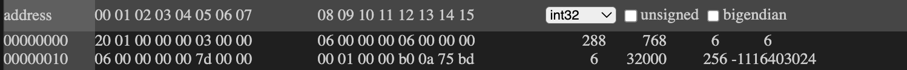

#### llama2-rs

##### Description:
- We're already late in the party but we will still attempt to replicate Karpathy's llama2.c in Rust


##### Constraints
- Use `memmap2` crate since Karpathy's implementation uses memmap in raw C.
- Use `clap` crate for command-line interface instead of default Rust cli from standard library.

#### Main Parts
- The `Configuration` part - **First Iteration: DONE**
- Setup debugger for both `llama2.c` and `llama-rs` - **DONE**
- Read about **Virtual Memory** and **mmap** - **TODO**
- The `Transformer` part - **TODO**
- The `Tokenizer` part - **TODO**
- The `Sampler` part - **TODO**
- The `Mode` part (Generate/Chat) - **TODO**


### Parsing Model File
First, we fill up the necessary data for the configuration:

```rust
struct Config {
    dim : i32,
    hidden_dim : i32,
    n_layers: i32,
    n_heads: i32,
    n_kv_heads: i32,
    vocab_size: i32,
    seq_len: i32,
}
```
Which can be derived from the header of `../models/stories15M.bin`

### Challenges:

#### Representing Slices to Different Types
- The model weights data which will come from a file will certainly be represented initially as `&[u8]`. Meanwhile, this needs to be represented as `&[f32]`. The main challenge here is how to safely cast `&[u8]` -> `&[f32]`. This should be done such that we can maintain the ownership of the owner of `&[u8]`.  